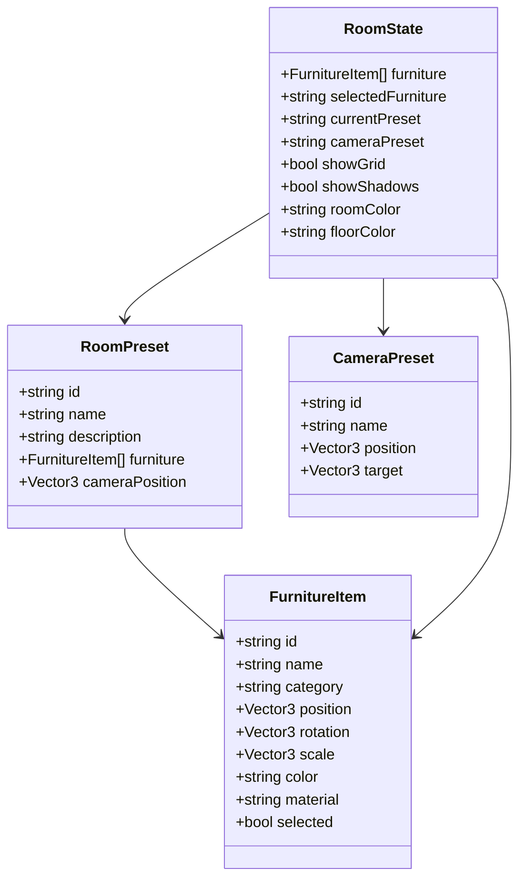

# Data Model Documentation

## Overview

This document details the core data models used in the 3D Room Designer application. The models are implemented in TypeScript and are used for managing the state of the room, furniture, and camera within the client-side application. All data is managed in-memory using Zustand and is not persisted to a backend or database.

---

## 1. FurnitureItem

Represents a single piece of furniture in the room.

```typescript
interface FurnitureItem {
  id: string; // Unique identifier for the furniture item
  name: string; // Display name (e.g., 'Modern Sofa')
  category: 'seating' | 'tables' | 'storage' | 'decor' | 'lighting'; // Furniture category
  position: Vector3; // 3D position in the room (Three.js Vector3)
  rotation: Vector3; // 3D rotation (Three.js Vector3)
  scale: Vector3; // 3D scale (Three.js Vector3)
  color: string; // Hex color code (e.g., '#8B4513')
  material?: string; // Optional material description
  selected?: boolean; // Optional flag for selection state
}
```

### Example
```json
{
  "id": "1",
  "name": "Modern Sofa",
  "category": "seating",
  "position": { "x": 2, "y": 0.5, "z": 0 },
  "rotation": { "x": 0, "y": -1.57, "z": 0 },
  "scale": { "x": 1, "y": 1, "z": 1 },
  "color": "#696969"
}
```

---

## 2. RoomPreset

Represents a predefined room layout with a set of furniture and optional camera position.

```typescript
interface RoomPreset {
  id: string; // Unique identifier for the preset
  name: string; // Preset name (e.g., 'Modern Living')
  description: string; // Short description
  furniture: FurnitureItem[]; // List of furniture items in the preset
  cameraPosition?: Vector3; // Optional camera position for the preset
}
```

### Example
```json
{
  "id": "modern-living",
  "name": "Modern Living",
  "description": "Contemporary living room setup",
  "furniture": [
    { "id": "1", "name": "Modern Sofa", "category": "seating", "position": { "x": 2, "y": 0.5, "z": 0 }, "rotation": { "x": 0, "y": -1.57, "z": 0 }, "scale": { "x": 1, "y": 1, "z": 1 }, "color": "#696969" },
    { "id": "2", "name": "Coffee Table", "category": "tables", "position": { "x": 0, "y": 0.4, "z": 1 }, "rotation": { "x": 0, "y": 0, "z": 0 }, "scale": { "x": 1, "y": 1, "z": 1 }, "color": "#8B4513" }
  ]
}
```

---

## 3. CameraPreset

Represents a predefined camera view for the 3D scene.

```typescript
interface CameraPreset {
  id: string; // Unique identifier for the camera preset
  name: string; // Display name (e.g., 'Isometric')
  position: Vector3; // Camera position in 3D space
  target: Vector3; // Point the camera is looking at
}
```

### Example
```json
{
  "id": "isometric",
  "name": "Isometric",
  "position": { "x": 8, "y": 8, "z": 8 },
  "target": { "x": 0, "y": 0, "z": 0 }
}
```

---

## 4. RoomState (Zustand Store)

Represents the overall state managed by Zustand, including furniture, presets, camera, and UI flags.

```typescript
interface RoomState {
  furniture: FurnitureItem[];
  selectedFurniture: string | null;
  currentPreset: string;
  cameraPreset: string;
  showGrid: boolean;
  showShadows: boolean;
  roomColor: string;
  floorColor: string;
  // ...actions for manipulating state (add, remove, update, etc.)
}
```

---

## 5. Vector3 (Three.js)

Used for 3D position, rotation, and scale in all models.

```typescript
class Vector3 {
  x: number;
  y: number;
  z: number;
}
```

---

## Relationships

- `RoomPreset` contains multiple `FurnitureItem` objects.
- `RoomState` manages the current list of `FurnitureItem` objects and the active `RoomPreset` and `CameraPreset`.
- `CameraPreset` is referenced by `RoomState` to control the current camera view.

---

## Diagram



---

## Notes
- All data is managed in-memory; there is no backend or persistent storage.
- The data model is optimized for real-time, interactive 3D editing in the browser.
- Vector3 is from Three.js and is used throughout for spatial data.
